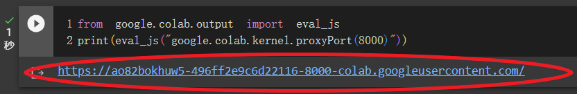
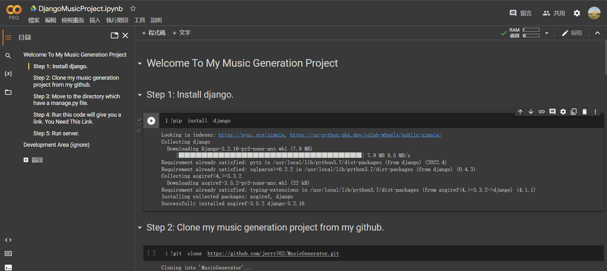
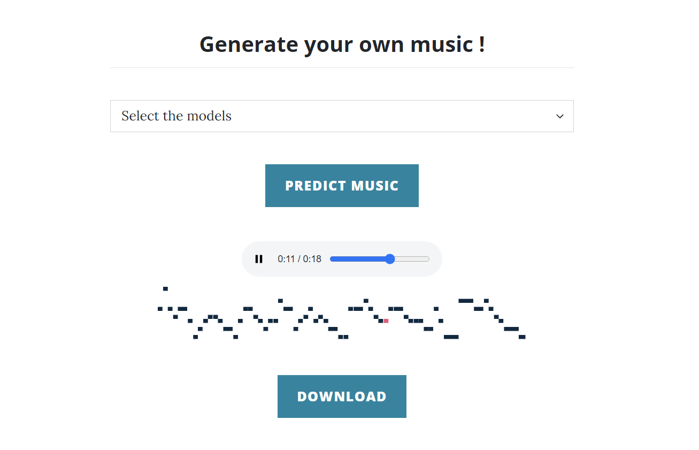

# TTU AI Music Generation Project  


  - [Project Advisor](https://tchinfo.ttu.edu.tw/tchinfo.php?id=chingyeh)
  - [Senior Project Report](LSTMTransformer20230620.pdf)
  - [Google Colab](https://colab.research.google.com/drive/1VRnq9hjKyu-JEpGC2bWl6-L3nZtOlzEi?usp=sharing)


## Introduction  

在本專題中，我們先是使用了[music21函式庫](http://web.mit.edu/music21/)將從[KernScores](http://kern.ccarh.org/)下載下來的Humdrum檔案轉換成我們在訓練時所需的格式，在經過資料的處理後透過[LSTM模型](https://en.wikipedia.org/wiki/Long_short-term_memory)去進行第一次的生成，生成出一段音樂的主旋律，然後再將所生成的旋律利用[Google Magenta團隊](https://magenta.tensorflow.org/music-transformer)所開發的[Transformer模型](https://en.wikipedia.org/wiki/Transformer_(machine_learning_model))去做生成伴奏的動作，
藉此讓音樂整體變得沒那麼單調、更具有豐富性。  

<table>
  <tr>
    <th>LSTM Model</th>
    <th>Transformer Model</th>
  </tr>
  
  <tr>
    <td><audio controls>
        <source src="music/lstm.wav" type="audio/wav">
        Your browser does not support the audio element.
        </audio></td>
    <td><audio controls>
  <source src="music/transformer.wav" type="audio/wav">
        Your browser does not support the audio element.
        </audio></td>
  </tr>
</table>


## Running  

### Step 1: Go to my [colab](https://colab.research.google.com/drive/1VRnq9hjKyu-JEpGC2bWl6-L3nZtOlzEi?usp=sharing)  

### Step 2: 
  

### Step 3: 
  

### Step 4: 
  

### Step 5: 
  

### Step 6: 
  

### Step 7: Click this link 
  


## Website Presentation  







## Reference  

[https://arxiv.org/ftp/arxiv/papers/1804/1804.07300.pdf](https://arxiv.org/ftp/arxiv/papers/1804/1804.07300.pdf)

[https://colab.research.google.com/notebooks/magenta/piano_transformer/piano_transformer.ipynb](https://colab.research.google.com/notebooks/magenta/piano_transformer/piano_transformer.ipynb)

[http://kern.humdrum.org/help/tour/](http://kern.humdrum.org/help/tour/)

[https://arxiv.org/pdf/1706.03762.pdf](https://arxiv.org/pdf/1706.03762.pdf)

[http://web.mit.edu/music21/](http://web.mit.edu/music21/)

[https://github.com/musikalkemist](https://github.com/musikalkemist)

[https://docs.djangoproject.com/en/4.1/](https://docs.djangoproject.com/en/4.1/)

[https://medium.com/@arsindoliya/running-django-on-google-colab-ea9392cdee86](https://medium.com/@arsindoliya/running-django-on-google-colab-ea9392cdee86)

[https://arxiv.org/pdf/1809.04281.pdf](https://arxiv.org/pdf/1809.04281.pdf)


## Project Structure  

```
.
├── TestApp
│   ├── __init__.py
│   ├── __pycache__
│   │   ├── __init__.cpython-37.pyc
│   │   ├── admin.cpython-37.pyc
│   │   ├── apps.cpython-37.pyc
│   │   ├── models.cpython-37.pyc
│   │   └── views.cpython-37.pyc
│   ├── admin.py
│   ├── apps.py
│   ├── lstm_music
│   │   └── output.mid
│   ├── mappings
│   │   ├── mapping_Africa.json
│   │   ├── mapping_America.json
│   │   ├── mapping_British.json
│   │   ├── mapping_Canada.json
│   │   ├── mapping_China.json
│   │   ├── mapping_France.json
│   │   ├── mapping_Germany.json
│   │   ├── mapping_Ireland.json
│   │   ├── mapping_Luxembourg.json
│   │   ├── mapping_Pentatonic.json
│   │   └── mapping_Poland.json
│   ├── migrations
│   │   ├── __init__.py
│   │   └── __pycache__
│   │       └── __init__.cpython-37.pyc
│   ├── models
│   │   ├── model_Africa.h5
│   │   ├── model_America.h5
│   │   ├── model_British.h5
│   │   ├── model_Canada.h5
│   │   ├── model_China.h5
│   │   ├── model_France.h5
│   │   ├── model_Germany.h5
│   │   ├── model_Ireland.h5
│   │   ├── model_Luxembourg.h5
│   │   ├── model_Pentatonic.h5
│   │   └── model_Poland.h5
│   ├── models.py
│   ├── tests.py
│   └── views.py
├── db.sqlite3
├── manage.py
├── portfolio
│   ├── __init__.py
│   ├── __pycache__
│   │   ├── __init__.cpython-37.pyc
│   │   ├── settings.cpython-37.pyc
│   │   ├── urls.cpython-37.pyc
│   │   └── wsgi.cpython-37.pyc
│   ├── asgi.py
│   ├── settings.py
│   ├── urls.py
│   └── wsgi.py
├── static_test
│   ├── css
│   │   └── styles.css
│   ├── images
│   │   ├── Bach.png
│   │   ├── Canada_folksong.jpg
│   │   ├── China_folksong.jpg
│   │   ├── Germany_folksong.jpg
│   │   ├── Schubert.png
│   │   ├── Stephen_Foster.jpg
│   │   ├── dataset.jpg
│   │   ├── dataset_header.jpg
│   │   ├── head_music.jpg
│   │   ├── kern_web.png
│   │   ├── music.ico
│   │   └── piano_header.jpg
│   ├── js
│   │   └── scripts.js
│   └── music
│       ├── Bach_dataset.mid
│       ├── Bach_lstm.mid
│       ├── Bach_transformer.mid
│       ├── Canada_dataset.mid
│       ├── Canada_lstm.mid
│       ├── Canada_transformer.mid
│       ├── China_dataset.mid
│       ├── China_lstm.mid
│       ├── China_transformer.mid
│       ├── Germany_dataset.mid
│       ├── Germany_lstm.mid
│       ├── Germany_transformer.mid
│       ├── Schubert_dataset.mid
│       ├── Schubert_lstm.mid
│       ├── Schubert_transformer.mid
│       ├── Stephen Foster_dataset.mid
│       ├── Stephen_Foster_lstm.mid
│       ├── Stephen_Foster_transformer.mid
│       ├── accompaniment.mid
│       └── output.mid
└── templates
    ├── dataset.html
    ├── generation.html
    └── index.html

15 directories, 84 files
```

