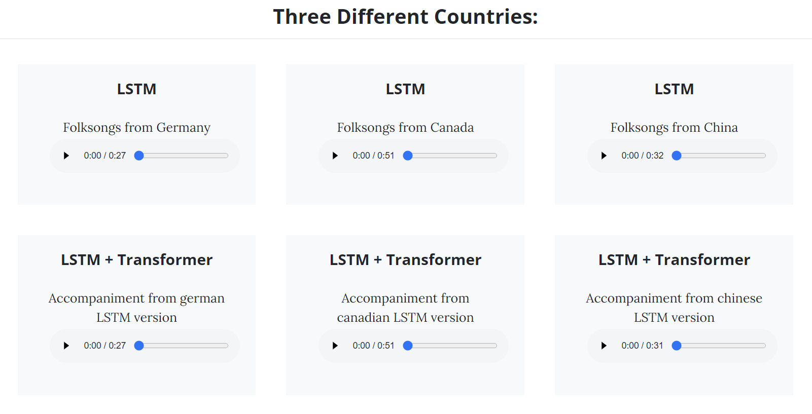

# AI Music Generator





```
.
├── TestApp
│   ├── __init__.py
│   ├── __pycache__
│   │   ├── __init__.cpython-37.pyc
│   │   ├── admin.cpython-37.pyc
│   │   ├── apps.cpython-37.pyc
│   │   ├── models.cpython-37.pyc
│   │   └── views.cpython-37.pyc
│   ├── admin.py
│   ├── apps.py
│   ├── lstm_music
│   │   └── output.mid
│   ├── mappings
│   │   ├── mapping_Africa.json
│   │   ├── mapping_America.json
│   │   ├── mapping_British.json
│   │   ├── mapping_Canada.json
│   │   ├── mapping_China.json
│   │   ├── mapping_France.json
│   │   ├── mapping_Germany.json
│   │   ├── mapping_Ireland.json
│   │   ├── mapping_Luxembourg.json
│   │   ├── mapping_Pentatonic.json
│   │   └── mapping_Poland.json
│   ├── migrations
│   │   ├── __init__.py
│   │   └── __pycache__
│   │       └── __init__.cpython-37.pyc
│   ├── models
│   │   ├── model_Africa.h5
│   │   ├── model_America.h5
│   │   ├── model_British.h5
│   │   ├── model_Canada.h5
│   │   ├── model_China.h5
│   │   ├── model_France.h5
│   │   ├── model_Germany.h5
│   │   ├── model_Ireland.h5
│   │   ├── model_Luxembourg.h5
│   │   ├── model_Pentatonic.h5
│   │   └── model_Poland.h5
│   ├── models.py
│   ├── tests.py
│   └── views.py
├── db.sqlite3
├── manage.py
├── portfolio
│   ├── __init__.py
│   ├── __pycache__
│   │   ├── __init__.cpython-37.pyc
│   │   ├── settings.cpython-37.pyc
│   │   ├── urls.cpython-37.pyc
│   │   └── wsgi.cpython-37.pyc
│   ├── asgi.py
│   ├── settings.py
│   ├── urls.py
│   └── wsgi.py
├── static_test
│   ├── css
│   │   └── styles.css
│   ├── images
│   │   ├── Bach.png
│   │   ├── Canada_folksong.jpg
│   │   ├── China_folksong.jpg
│   │   ├── Germany_folksong.jpg
│   │   ├── Schubert.png
│   │   ├── Stephen_Foster.jpg
│   │   ├── dataset.jpg
│   │   ├── dataset_header.jpg
│   │   ├── head_music.jpg
│   │   ├── kern_web.png
│   │   ├── music.ico
│   │   └── piano_header.jpg
│   ├── js
│   │   └── scripts.js
│   └── music
│       ├── Bach_dataset.mid
│       ├── Bach_lstm.mid
│       ├── Bach_transformer.mid
│       ├── Canada_dataset.mid
│       ├── Canada_lstm.mid
│       ├── Canada_transformer.mid
│       ├── China_dataset.mid
│       ├── China_lstm.mid
│       ├── China_transformer.mid
│       ├── Germany_dataset.mid
│       ├── Germany_lstm.mid
│       ├── Germany_transformer.mid
│       ├── Schubert_dataset.mid
│       ├── Schubert_lstm.mid
│       ├── Schubert_transformer.mid
│       ├── Stephen Foster_dataset.mid
│       ├── Stephen_Foster_lstm.mid
│       ├── Stephen_Foster_transformer.mid
│       ├── accompaniment.mid
│       └── output.mid
└── templates
    ├── dataset.html
    ├── generation.html
    └── index.html

15 directories, 84 files
```